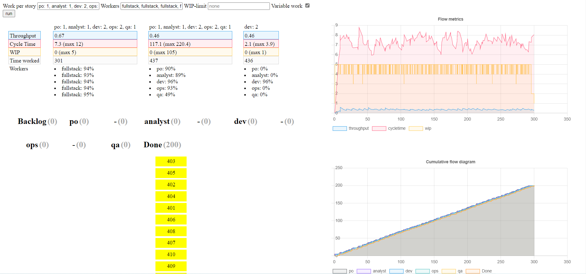

# Experiencing Team Flow

Speaker : Michel Grootjans

Objectif : Techniques pour débloquer un embouteillage.

## Intro 

Traffic-simulation : https://traffic-simulation.de/

Analogie : 
- inflow = features poussées par le PO
- onramp = bugs de production

## Expérience

The dot game : 
- https://github.com/michelgrootjans/dot-game
- https://afternoon-bayou-75731.herokuapp.com/

`PO -> Analyst -> Dev -> Ops -> QA`

Actions : 
- PO : click
- Analyst : affectation (click + entrer valeur)
- Dev : addition / soustraction
- Ops : division
- QA : validation

Définitions :
- lead-time / cycle time : temps que le ticket met à arriver en production
- thoughput : rythme de sortie des features (ex 2 features / jour)

**Round 1** : push batches of 4 prendre les tâches 4 par 4.

**Round 2** : pas de batch, tout le monde en Vmax. Les tâches s'empilent au niveau du dev. Avec le stress, on voit des défaults apparaîtrent. 

**Round 3** : limiter count(ongoing + done) à 4 pour chaque rôle. Fluide, encours limité, améliore le lead time.

**Round 4** : limiter le WIP : count(toute la chaîne) <= 6. Fluuuuiiiiide ! Lead-time excellent, mais il arrive que le dev n'ai rien à faire.

**Round 5** : drum buffer road : le PO fait en sorte que le dev ai toujours 1 tâche ou deux de prêtes à démarrer. Lead-time optimisé

## Simulation

Kanban simulator : 
- https://github.com/michelgrootjans/explaining-flow
- https://michelgrootjans.github.io/explaining-flow/

Jusqu'à présent, on a vu comment améliorer le lead-time. Mais le rythme de livraison reste le même ! Dans cette partie, Michel montre comment passer d'une chaîne de 5 personnes spécialisées sur leurs postes et dépendantes des autres en entrée à un optimal (non atteignable mais approchable) de 5 personnes full-stack permet de'améliorer rythme de livraison.

## Key Takeway

- pour réduire le lead-time, réduire le WIP
- pour améliorer le rythme de production (thoughput) : favoriser les personnes / équipes qui sont capable de prendre un problème de bout en bout (fullstack, feature team).
- les estimations sont toujours fausses (on estime l'effort = différent du lead-time)
